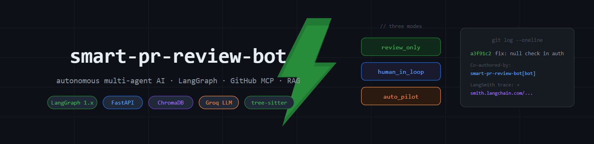
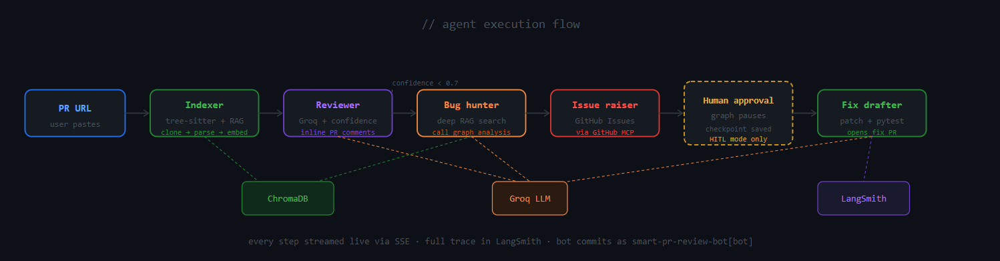
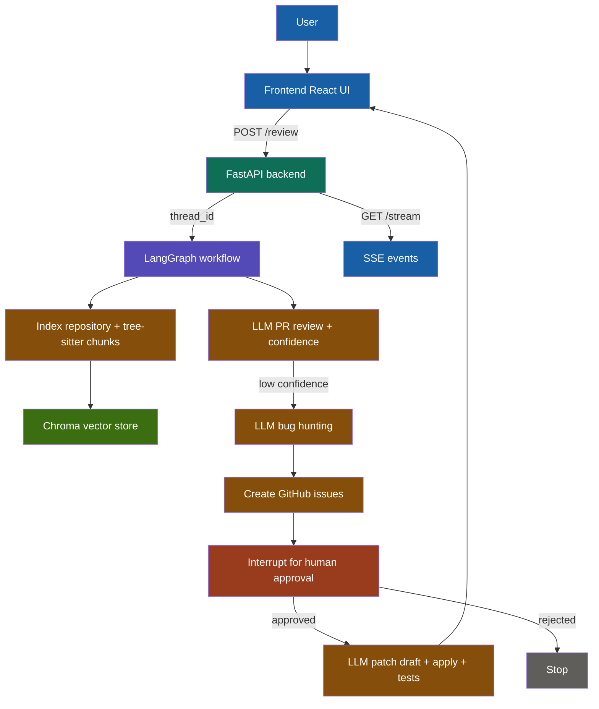
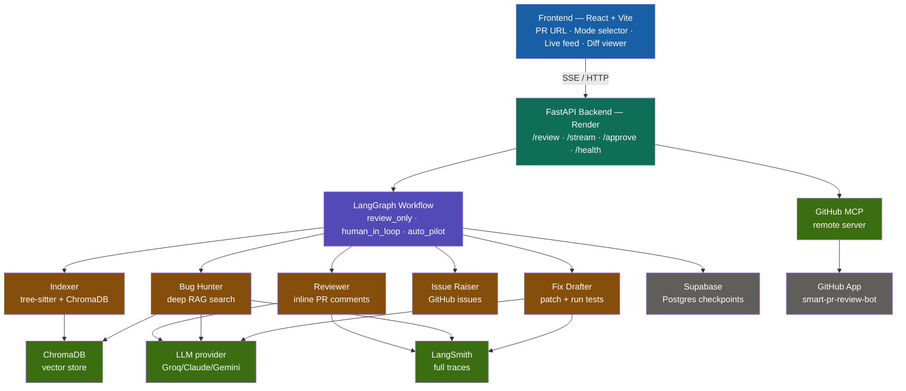
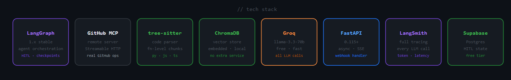

<div align="center">



# smart-pr-review-bot

**Autonomous multi-agent AI system for intelligent GitHub PR review and bug detection.**
Powered by LangGraph, RAG + tree-sitter, and GitHub MCP for real codebase understanding.
Automatically raises GitHub Issues, drafts fixes, and opens PRs as `smart-pr-review-bot[bot]`.
Supports Review Only, Human-in-Loop, and Auto Pilot modes with full LangSmith tracing.

<br/>

[](https://python.org)
[](https://langchain.com/langgraph)
[](https://fastapi.tiangolo.com)
[](https://groq.com)
[](./LICENSE)

<br/>

</div>

---

## What it does

Paste a PR URL. The agent does the rest.

```
PR URL → Index codebase → Review PR → Hunt bugs → Raise Issues → Draft fix → Open fix PR
```

Three modes, one URL:

| Mode | What happens |
|---|---|
| **Review only** | Reviews PR, posts inline comments, raises GitHub Issues for bugs found |
| **Human-in-loop** | Same as above + shows fix diff, waits for your approval before pushing |
| **Auto pilot** | Fully autonomous — reviews, fixes, runs tests, opens fix PR automatically |

---

## Demo


---

## Agent flow





---

## Full architecture




---

## Tech stack



| Layer | Technology |
|---|---|
| LLM | Groq by default; Claude/Gemini via BYOK |
| Agent orchestration | LangGraph 1.x with conditional edges + checkpointing |
| GitHub integration | Remote GitHub MCP server via Streamable HTTP |
| Code parsing | tree-sitter — function and class level chunks |
| Vector store | ChromaDB — embedded, no extra service |
| Backend | FastAPI + SSE streaming |
| Frontend | React + Vite |
| Checkpointing | Supabase Postgres (LangGraph HITL state) |
| Tracing | LangSmith — full agent execution traces |
| Deploy | Render (backend) + Vercel (frontend) |

---

## How RAG works here

Unlike normal document RAG that splits text by character count, this project uses **tree-sitter** to parse code into meaningful chunks — whole functions, whole classes. So when the bug hunter asks "what does `authenticate_user` do?" ChromaDB returns the complete function, not a random slice.

```
Normal RAG          →  random 500-char chunks  →  broken functions
tree-sitter RAG     →  complete functions       →  real understanding
```

---

## Setup

### Prerequisites

- Python 3.11+
- Node 18+
- Supabase account (free)
- Groq API key (required for default provider)
- Claude/Gemini API keys (optional; provided via UI)
- LangSmith account (free)
- GitHub App with App ID + private key

### Environment

```bash
cp .env.example .env
```

Fill in `.env`:

```env
GROQ_API_KEY=
GITHUB_APP_ID=3222129
GITHUB_PRIVATE_KEY=       # contents of your .pem file
GITHUB_WEBHOOK_SECRET=
DATABASE_URL=             # Supabase Postgres URL
LANGCHAIN_API_KEY=
LANGSMITH_PROJECT=smart-pr-review-bot
CHROMA_PERSIST_DIR=./chroma_db
GITHUB_MCP_URL=https://api.githubcopilot.com/mcp/
FRONTEND_URL=http://localhost:5173
```

### Backend

```bash
pip install -r requirements.txt
uvicorn backend.main:app --reload --host 127.0.0.1 --port 8000
```

### Frontend

```bash
cd frontend
npm install
npm run dev
```

---

## API

| Method | Path | Description |
|---|---|---|
| `GET` | `/health` | Health + graph readiness |
| `POST` | `/review` | Start a review workflow — returns `thread_id` |
| `GET` | `/stream/{thread_id}` | SSE stream of agent step events |
| `POST` | `/approve` | Approve or reject in `human_in_loop` mode |
| `POST` | `/webhook` | GitHub webhook — auto-triggers on PR open/sync |

### Example

```bash
# start a review
curl -X POST http://localhost:8000/review \
  -H "Content-Type: application/json" \
  -d '{
    "pr_url": "https://github.com/owner/repo/pull/42",
    "mode": "human_in_loop",
    "llm_provider": "groq",
    "llm_api_key": null,
    "llm_model": null
  }'

# stream progress
curl http://localhost:8000/stream/{thread_id}

# approve the fix
curl -X POST http://localhost:8000/approve \
  -H "Content-Type: application/json" \
  -d '{"thread_id": "...", "approved": true}'
```

---

## Deploy

### Backend — Render

```bash
# render.yaml already configured
# set env vars in Render dashboard matching .env.example
# start command: uvicorn backend.main:app --host 0.0.0.0 --port $PORT
```

### Frontend — Vercel

```bash
# vercel.json already configured
# build from frontend/ into frontend/dist
# SPA routing rewrites all paths to index.html
```

### Kubernetes (CI/CD via GitHub Actions)

Three workflows included:

| Workflow | Trigger | What it does |
|---|---|---|
| `ci.yml` | PR | Lint + test |
| `build-push.yml` | push to `main` | Build Docker image → push to GHCR |
| `deploy.yml` | push to `main` | Deploy to Kubernetes cluster |

Required GitHub Actions secrets:

```
KUBECONFIG_B64     # base64-encoded kubeconfig
GHCR_TOKEN         # GitHub container registry token
```

Kubernetes manifests in `k8s/`:

```
k8s/deployment.yaml
k8s/service.yaml
k8s/secret.yaml.example   # copy and fill in — never commit actual secrets
```

---

## GitHub App contributor attribution

When the bot creates commits using its installation token, it appears as `smart-pr-review-bot[bot]` in the repo's contributor list — the same way `cursor[bot]` and `github-actions[bot]` appear.

Fix PR commit messages include:

```
fix: handle JWT expiry in authenticate_user()

Auto-fix generated by smart-pr-review-bot
Reviewed {pr_url} · Found via RAG over codebase

Co-authored-by: {your-name} <your@email.com>
Co-authored-by: smart-pr-review-bot[bot] <smart-pr-review-bot[bot]@users.noreply.github.com>
```

---

## Project structure

```
smart-pr-review-bot/
├── backend/
│   ├── main.py                  ← FastAPI app + webhook handler
│   ├── config.py                ← pydantic-settings BaseSettings
│   ├── auth/
│   │   └── github_auth.py       ← GitHub App JWT + installation token
│   ├── agents/
│   │   ├── indexer.py           ← tree-sitter + ChromaDB RAG
│   │   ├── reviewer.py          ← PR review + inline comments
│   │   ├── bug_hunter.py        ← deep RAG bug search
│   │   ├── issue_raiser.py      ← creates GitHub Issues
│   │   └── fix_drafter.py       ← patch + test runner
│   ├── graph/
│   │   └── workflow.py          ← LangGraph graph + conditional edges
│   └── models/
│       ├── state.py             ← WorkflowState TypedDict
│       └── schemas.py           ← Pydantic v2 models
├── frontend/
│   └── src/
│       ├── App.jsx
│       └── components/
│           ├── PRInput.jsx
│           ├── ModeSelector.jsx
│           ├── LiveFeed.jsx
│           ├── DiffViewer.jsx
│           └── ApprovePanel.jsx
├── k8s/
├── .github/workflows/
├── .cursorrules
├── .env.example
├── render.yaml
├── vercel.json
└── requirements.txt
```

---

## LangSmith tracing

Every agent run produces a full LangSmith trace — every LLM call, every RAG query, every MCP tool call, token count per step, and total latency. The trace link is included in every fix PR description so anyone reviewing the PR can see exactly how the agent reached its conclusion.

---

<div align="center">

Built by [@kushalsai-01](https://github.com/kushalsai-01) · MIT License

</div>